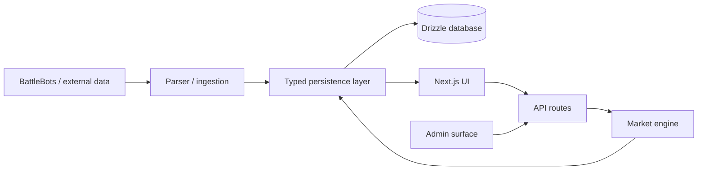

# Arena Odds

A full-stack prototype for **prediction markets around BattleBots matches**. The application ingests fight/event data, creates and resolves markets, tracks user positions, and exposes portfolio, leaderboard, market, and admin surfaces through a Next.js application backed by Drizzle.

> **Project status:** working product prototype. The repository has a build-before-test workflow and a typed database/application stack, but it should be treated as a demo rather than a regulated or real-money betting system.

## What is implemented

- BattleBots data parsing / ingestion;
- market creation and resolution logic;
- positions and portfolio accounting;
- leaderboard and market pages;
- admin workflows;
- API routes and ChatGPT-oriented authentication/integration code;
- Drizzle schema/migrations;
- Cloudflare/Vinext-oriented build/deployment configuration;
- automated tests executed after a production build.

## Key components

| File / area | Responsibility |
| --- | --- |
| [`lib/market-engine.ts`](lib/market-engine.ts) | core market transition / pricing logic |
| [`lib/store.ts`](lib/store.ts) | persistence and application data access |
| [`lib/battlebots-parser.ts`](lib/battlebots-parser.ts) | external-data normalization |
| [`app/api/`](app/api/) | server/API boundary |
| [`app/markets/`](app/markets/) | market-facing product surface |
| [`app/portfolio/`](app/portfolio/) | position/portfolio surface |
| [`app/admin/`](app/admin/) | operational/admin paths |
| [`drizzle/`](drizzle/) + [`db/`](db/) | schema and migrations |
| [`tests/`](tests/) | domain behavior exercised independently of the UI |

The application separates market/domain transitions in `lib/` from persistence and the web application rather than coupling all market behavior directly to the UI.

## Architecture



## Local development

The project requires Node 22.13+.

```bash
npm ci
npm run dev
```

Useful checks:

```bash
npm run lint
npm test
```

`npm test` intentionally performs the application build first and then runs the Node test suite, so broken production compilation is not hidden by passing isolated tests.

Database schema changes can be generated with:

```bash
npm run db:generate
```

See [`.env.example`](.env.example) for runtime configuration.

## Repository structure

```text
app/            Next.js routes, pages, API and UI components
lib/            parsing, market engine, data access
db/             database setup / schema support
drizzle/        generated migrations
tests/          domain/application tests
```

## Limitations

- This is not a real-money exchange and does not implement the compliance, custody, settlement, abuse prevention, or financial controls such a system would require.
- External event data can be incomplete or change format; parser behavior should be treated as a maintained integration boundary.
- Market behavior is only as sound as the invariants covered by the current domain tests; more adversarial property tests would be valuable.
- Some application surfaces are prototype-oriented and the repository is not a general-purpose prediction-market framework.

## Future work

A useful next step would be to specify market invariants explicitly—e.g. allowed state transitions, position accounting, settlement idempotency and impossible negative balances—and exercise them with property/state-machine tests. That would make the domain model easier to trust independently of the UI and external event feed.
